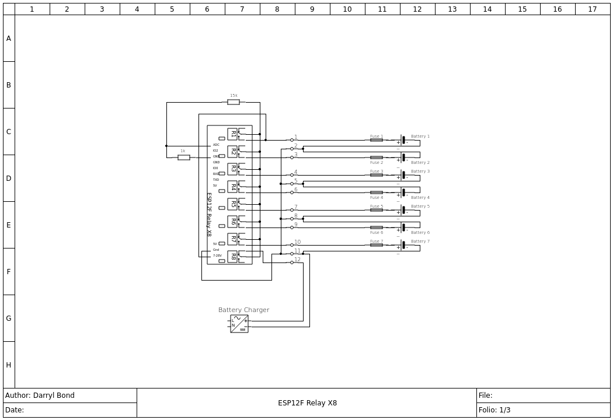
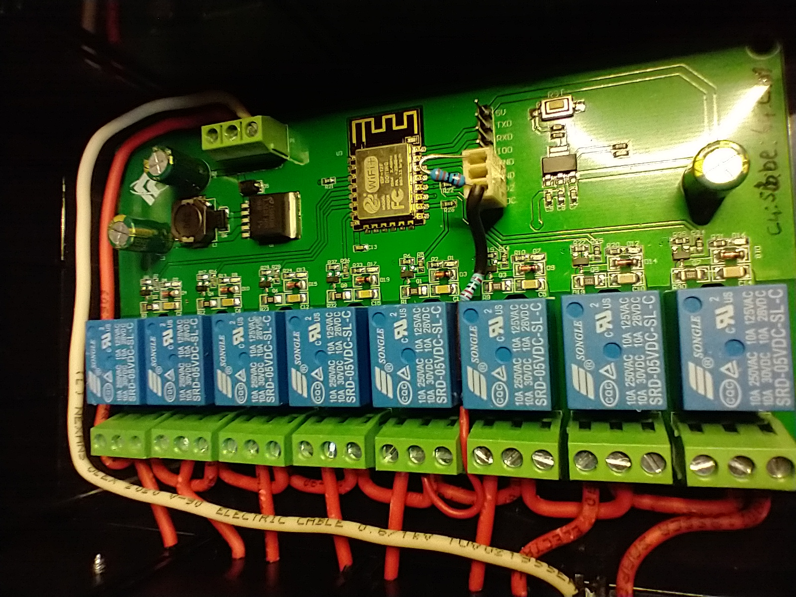
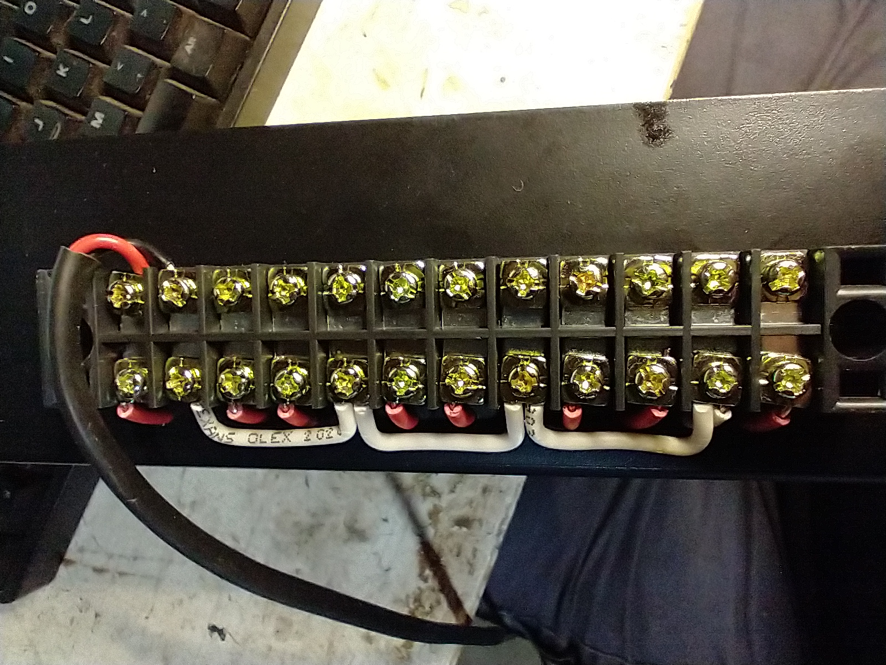

# BatteryCharger
Multiplexed Battery Charger for maintaining up to 7 batteries from one charger, an 8th battery can be connected and charged but not maintained.

Based on the ESP12F\_Relay\_X8\_V1.1 integrated ESP8266 8 relay board.
A connected charger cycles through each battery in turn. The analog input monitors the battery terminal voltage of the battery. 

The charger is disconnected to measure the actual battery terminal volts by the No 8 relay therefore each module can manage 7 batteries. 

The board operates as an AP with captive portal or connects to a local network. Connecting to the AP with a mobile phone displays the normal captive portal login page, in this case it simply displays the battery status.
Use the Expressif Android app to connect the wifi the local network.

Electricals drawings by Qelectrotech.

 

## Construction
	- Connect the 1k resistor  between the ADC and GND and the 15k resistor between ADC and one of the COM terminals. (see Photograph)
	- Connect the 7-28V terminal to the NO8 relay
	- Connect the GND to the battery ground on the external terminal strip.
	- Follow the schematic to jumper between the module terminal strip and the external terminal strip.

