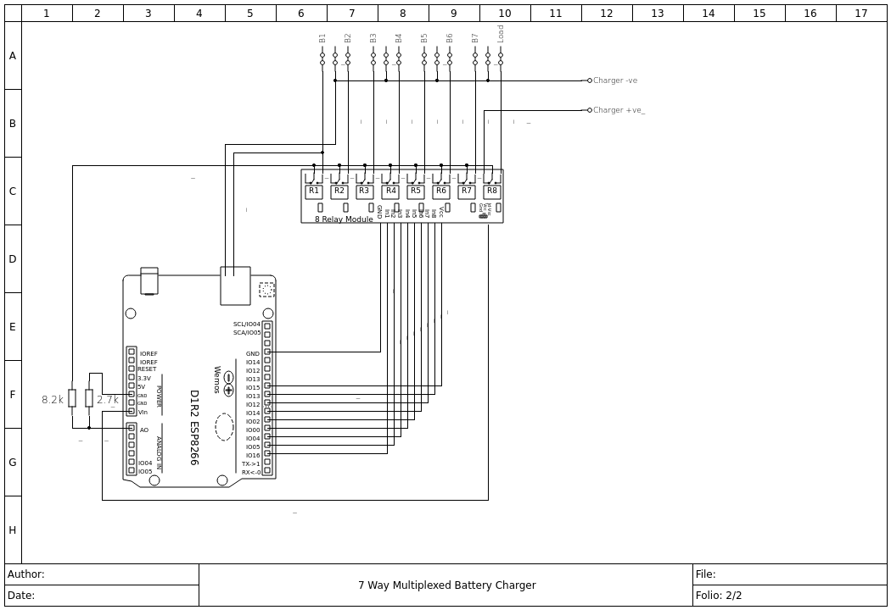
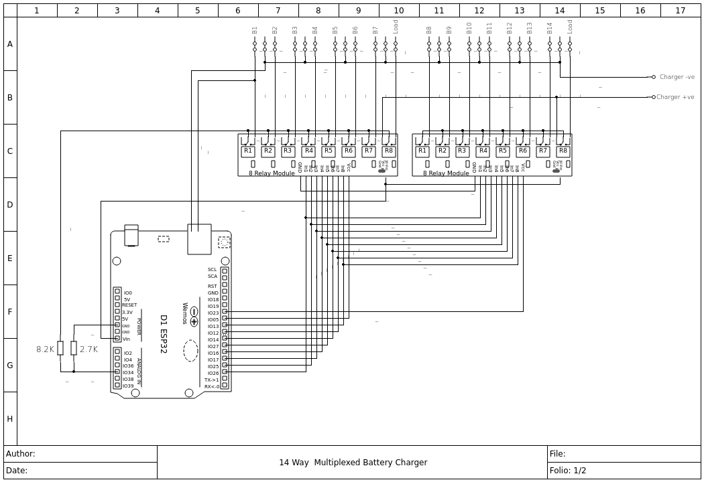

# BatteryCharger
Multiplexed Battery Charger for maintaining up to 8 batteries from one charger

Based on Wemos D1 R1 ESP8266 or Wemos D1 R32 board connected to a bank of 8 relays or Wemos D1 R32 board connected to a bank of 16 relays.
A connected charger cycles through each battery in turn. The analog input monitors the battery terminal voltage of the battery. 

The charger is disconnected to measure the actual battery terminal volts by the last relay in each bank, therefore each module can manage 7 batteries. A load can be connected so that the battery is loaded while measuring the terminal voltage.

The Wemos operates as an AP with captive portal or connects to a local network. Connecting to the AP with a mobile phone displays the normal captive portal login page, in this case it simply displays the battery status.
Use the Expressif Android app to connect the wifi the local network.

Electricals drawings by Qelectrotech.

