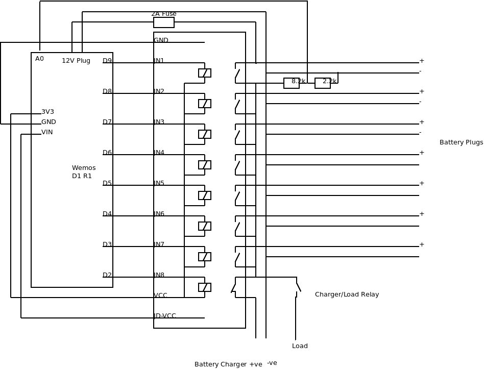

# BatteryCharger
Multiplexed Battery Charger for maintaining up to 8 batteries from one charger

Based on Wemos D1 R1 ESP8266 or Wemos D1 R32 board connected to a bank of 8 relays A connected charger cycles through each battery in turn. The analog input monitors the battery voltage of the battery currently being charged.

The Wemos operates as an AP with captive portal. Connecting to the AP with a mobile phone displays the normal captive portal login page, in this case it simply displays the battery status.

The relay board is connected to D2-D9 to Relays 1-8.

